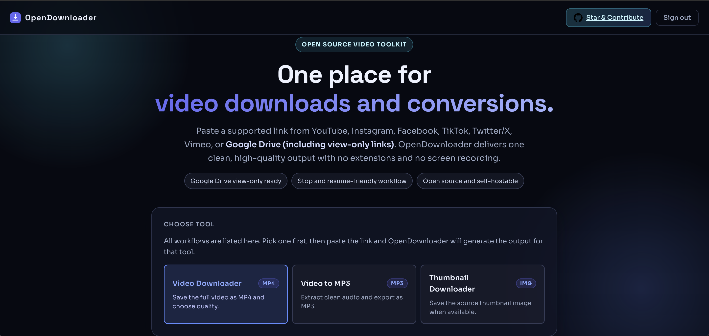
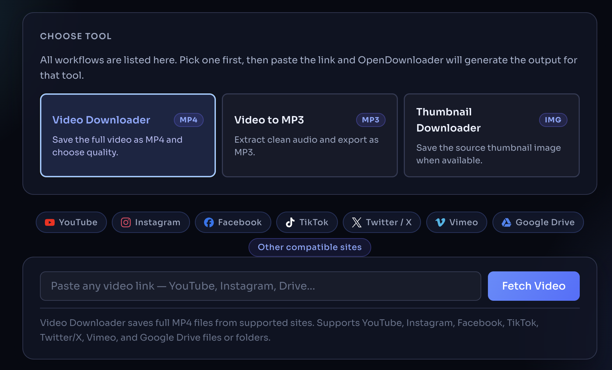
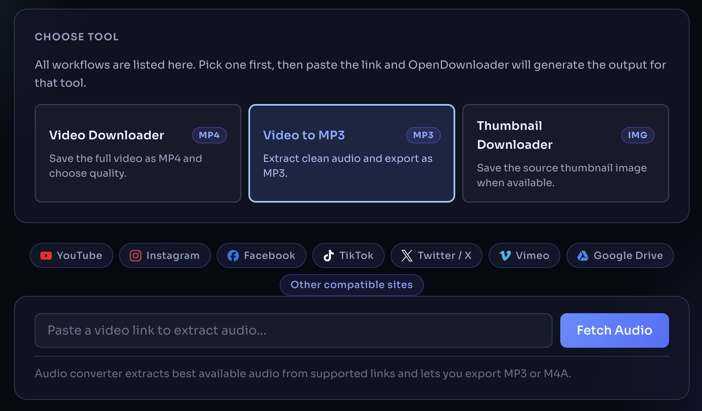
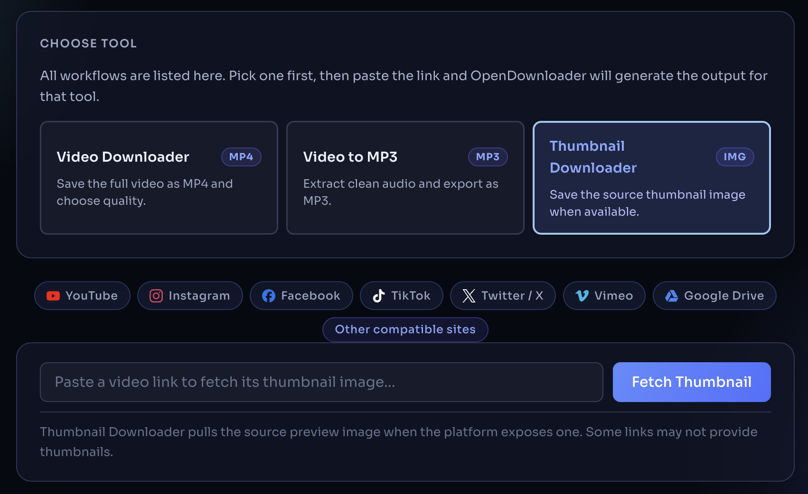

# OpenDownloader

<p align="center">
  <strong>Universal video, audio, and thumbnail downloader with a clean web UI.</strong>
</p>

<p align="center">
  <a href="https://github.com/ThiruvarankanM/OpenDownloader/blob/main/LICENSE"></a>
  
  
  
</p>

OpenDownloader helps you fetch media from supported links through one focused interface:
- Video download (MP4)
- Audio extraction (MP3/M4A)
- Thumbnail download (original/PNG/JPG/WEBP)

It includes task progress tracking, cancellation support, optional local auth bypass for development, and Docker-ready deployment files.

## Table of contents

- [Highlights](#highlights)
- [Screenshots](#screenshots)
- [Supported workflows](#supported-workflows)
- [Platform compatibility](#platform-compatibility)
- [Architecture](#architecture)
- [Quick start (local)](#quick-start-local)
- [Production-style local validation](#production-style-local-validation)
- [Docker deployment](#docker-deployment)
- [Nginx reverse proxy](#nginx-reverse-proxy)
- [Environment variables](#environment-variables)
- [Security and privacy](#security-and-privacy)
- [Community and support](#community-and-support)
- [Roadmap ideas](#roadmap-ideas)
- [Troubleshooting](#troubleshooting)
- [License](#license)

## Highlights

- Modern tool-based UI with clear flow for video, audio, and thumbnail tasks.
- Background task lifecycle: analyze, start, poll progress, cancel, serve file.
- Google Drive support with browser-auth session capture.
- Universal mode powered by yt-dlp for many public platforms.
- Secure defaults in production: JWT cookies, rate limiting, CORS, and Helmet.
- Fast local development mode with auth bypass when `NODE_ENV=development`.

## Screenshots

Main landing page:

<p align="center">
  
</p>

Core workflows:

<p align="center">
  
  
</p>

Task and result state:

<p align="center">
  
</p>

Image source files are stored in `docs/screenshots/` so they render correctly in GitHub.

## Supported workflows

| Workflow | Output | Notes |
|---|---|---|
| Video Downloader | MP4 | Quality selection supported |
| Video to Audio | MP3, M4A | Converted/extracted via backend pipeline |
| Thumbnail Downloader | Original, PNG, JPG, WEBP | Thumbnail conversion handled in app flow |

## Platform compatibility

OpenDownloader supports:
- Google Drive links (including protected/view-only flows after auth setup)
- A broad set of public video platforms via yt-dlp

Compatibility can vary by platform policy, content restrictions, login requirements, and link type.

## Architecture

### Backend
- Express API server
- Auth routes (`/api/auth/*`)
- Video/task routes (`/api/video/*`)
- Service layer for analyze/download/cancel/status
- Stream serving with temporary file cleanup

### Tooling stack
- Playwright for browser automation and authenticated media capture
- yt-dlp for universal platform extraction
- ffmpeg for mux/conversion tasks

### Frontend
- Single-page UI served from `public/`
- Tool switcher for mode-based actions
- Progress polling and task cancellation

## Quick start (local)

```bash
# 1. Clone and install
git clone https://github.com/ThiruvarankanM/OpenDownloader.git
cd OpenDownloader
npm install

# 2. Configure environment
cp .env.example .env

# 3. (Optional but recommended) Capture Google auth session
npm run setup:auth

# 4. Start server
npm run dev

# 5. Open app
# http://localhost:3000
```

Development behavior:
- When `NODE_ENV=development`, auth bypass is enabled by default unless overridden.
- In production, set `AUTH_BYPASS=false` and provide secure auth variables.

## Production-style local validation

Use this before deploying:

```bash
# Install dependencies
npm install

# Start app
npm run dev

# Verify server is reachable
curl http://localhost:3000

# Optional: health/auth check
curl http://localhost:3000/api/auth/status
```

Manual UI validation checklist:
- Test Video Downloader flow end-to-end.
- Test MP3 and M4A conversion flow.
- Test Thumbnail download flow for all output options.
- Test cancel action during active downloads.

## Docker deployment

Note: deployment rights are restricted by the project license and reserved to the copyright owner unless explicit written permission is granted.

```bash
cp .env.example .env
# Edit .env for your deployment

docker compose up -d --build
```

### One-time Google auth setup

Option A (recommended): capture session on local machine and copy `.browser-data/` to server.

```bash
npm install
npm run setup:auth
rsync -av .browser-data/ user@yourserver:/path/to/OpenDownloader/.browser-data/
```

Option B: use X11 forwarding on VPS.

```bash
ssh -X user@yourserver
docker compose run --rm \
  -e DISPLAY=$DISPLAY \
  -v /tmp/.X11-unix:/tmp/.X11-unix \
  opendownloader node scripts/setup-auth.js
```

## Nginx reverse proxy

```nginx
server {
    listen 443 ssl;
    server_name yourdomain.com;

    location / {
        proxy_pass         http://127.0.0.1:3000;
        proxy_set_header   Host              $host;
        proxy_set_header   X-Real-IP         $remote_addr;
        proxy_set_header   X-Forwarded-For   $proxy_add_x_forwarded_for;
        proxy_set_header   X-Forwarded-Proto $scheme;
        proxy_buffering    off;
        proxy_read_timeout 600s;
        proxy_send_timeout 600s;
    }
}
```

Set `ALLOWED_ORIGINS=https://yourdomain.com` in your `.env`.

## Environment variables

| Variable | Required | Description |
|---|---|---|
| `JWT_SECRET` | Yes (production) | Random string (at least 32 chars) |
| `ADMIN_USERNAME` | Yes (production) | Admin login username |
| `ADMIN_PASSWORD_HASH` | Yes (production) | bcrypt hash of password |
| `ALLOWED_ORIGINS` | Yes | Comma-separated allowed origins |
| `PORT` | No | Server port (default: `3000`) |
| `AUTH_BYPASS` | No | `true` for local dev convenience |
| `JWT_ACCESS_EXPIRY` | No | Access token lifetime (default: `15m`) |
| `JWT_REFRESH_EXPIRY` | No | Refresh token lifetime (default: `7d`) |
| `RATE_LIMIT_MAX` | No | API max requests per 15 min |
| `DOWNLOAD_RATE_MAX` | No | Download starts per 15 min |

Credential helpers:

```bash
# Generate JWT secret
node -e "console.log(require('crypto').randomBytes(32).toString('hex'))"

# Generate bcrypt hash for a password
node -e "import('bcryptjs').then(b => b.default.hash('yourpassword', 12).then(console.log))"
```

## Security and privacy

- Production mode uses signed JWT cookies and auth-protected routes.
- Rate limiting is enabled for auth, API, and download actions.
- `.browser-data/` contains sensitive Google session data. Never commit it.
- `.env` should never be committed. Use `.env.example` as template.
- Temporary download artifacts are cleaned after file serving.

GitHub safety checklist:
- Confirm `.env` is untracked.
- Confirm `.browser-data/` is untracked.
- Confirm `node_modules/` is untracked.
- Rotate secrets if they were exposed.

## Community and support

Community feedback is welcome through Issues.

You can open issues for bug reports, ideas, or documentation improvements at:
https://github.com/ThiruvarankanM/OpenDownloader/issues

Code usage rights are governed by the LICENSE file. Public source visibility does not grant permission to host, resell, or redeploy this project.

## Roadmap ideas

- Better download queue management and prioritization.
- Download history and retry UX.
- Optional file naming templates.
- Expanded integration and API tests.

## Troubleshooting

Common fixes:
- `AUTH_REQUIRED` for Google Drive:
  Run `npm run setup:auth` and complete sign-in.
- `yt-dlp` not found:
  Run `npm run setup:ytdlp` or install yt-dlp manually.
- Download fails after analysis:
  Re-analyze URL and verify the source link is still valid/public.
- Auth/cookie problems in production:
  Recheck `JWT_SECRET`, `ALLOWED_ORIGINS`, and HTTPS proxy settings.

## License

OpenDownloader Source-Available License. See [LICENSE](./LICENSE).

Please use this project responsibly and comply with copyright law and each platform's terms.
